# G4-SRTN Development Documentation

## Team Information 团队信息

**Team: Deep Thinkers-G4**

**Team Members and Contributions (in the order of final pre)**

-   **LIU Qifan (**[**fanfan\_lqf@163.com**](mailto:fanfan_lqf@163.com "fanfan_lqf@163.com")): 
    -   Kept track of project progress, read literature, and wrote the introduction and background sections of the paper.&#x20;
-   **YING Yiyuan (**[**yiyuanying@outlook.com**](mailto:yiyuanying@outlook.com "yiyuanying@outlook.com")): 
    -   Downloaded and organized Dataset 1 (TCGA-KIRC), wrote the data processing section of the paper.
-   **FAN Hongyue (**[**21011171@mail.ecust.edu.cn**](mailto:21011171@mail.ecust.edu.cn "21011171@mail.ecust.edu.cn")): 
    -   Processed Dataset 2 (BreastHis), proposed innovative methods for data handling.&#x20;
-   **CHEN Yishen (**[**ohhcys@gmail.com**](mailto:ohhcys@gmail.com "ohhcys@gmail.com")): 
    -   Team leader, responsible for guiding the direction of the project, proposed innovative methods for the model, and implemented the model's code.
-   **ZHANG Zehong (**[**21013074@mail.ecust.edu.cn**](mailto:21013074@mail.ecust.edu.cn "21013074@mail.ecust.edu.cn")): 
    -   Trained the model, fine-tuned parameters, and participated in the innovation process of the model.
-   **CHEN Ying (**[**21013172@mail.ecust.edu.cn**](mailto:21013172@mail.ecust.edu.cn "21013172@mail.ecust.edu.cn")): 
    -   Organized the output information of the model, wrote the model comparison and results sections of the paper, and created the PowerPoint presentation.

## Code File Tree 代码文件树

-   **Data1\_process**
    -   Step 1 SVS extracts png image blocks.py
    -   Step 2 Select suitable images.py
    -   Step 3 downsampling\_ X4 and x8 magnification.py
    -   Step 4 Delete abnormal images from each folder.py
    -   Step 5 Divide three datasets.py
-   **Data2\_process**
    -   0.Merge images of the same size.py
    -   1.Template matching 100X-400X.py
    -   2.Batch template matching 100X-400X.py
    -   3.Batch actuators.py
    -   4.Left center right segmentation.py
    -   5.Copy and Paste Enhancement.py
    -   6.Delete abnormal images.py
    -   7.Downsampling\_ X4 magnification.py
    -   8.Divide into three datasets.py
-   **Model Evaluation**
    -   Calculate the average MSE of interpolated images and HR.py
    -   Loss Curve of different models on BreakHis.py
    -   Loss Curve of SRTN on different datasets.py
    -   Model validation.py
-   **Models(other's)**
    -   EDSR.py
    -   SRCNN.py
    -   train\_EDSR.py
-   **SRTN(our model)**
    -   ScConv.py
    -   SRTN.py
    -   train\_SRTN.py
-   **Train\_result\_pth**

## Contents 

-   [Team Information 团队信息](#Team-Information-团队信息)
-   [Code File Tree 代码文件树](#Code-File-Tree-代码文件树)
-   [Data Acquisition and Processing 数据获取和处理](#Data-Acquisition-and-Processing-数据获取和处理)
    -   [Dataset 1 TCGA-KIRC 数据集1 TCGA-KIRC](#Dataset-1-TCGA-KIRC-数据集1-TCGA-KIRC)
        -   [Collection 收集来源](#Collection-收集来源)
    -   [Dataset 1 Processing 数据集1处理](#Dataset-1-Processing-数据集1处理)
        -   [Processing 处理步骤](#Processing-处理步骤)
        -   [Step 1 Image Segmentation 步骤1 图像分割](#Step-1-Image-Segmentation-步骤1-图像分割)
        -   [Step 2 Image Selection 步骤2 图像选择](#Step-2-Image-Selection-步骤2-图像选择) 
        -   [Step 3 Image Downsampling 步骤3 图像降采样](#Step-3-Image-Downsampling-步骤3-图像降采样)
        -   [Step 4 Secondary Selection 步骤4 二次筛选](#Step-4-Secondary-Selection-步骤4-二次筛选)
        -   [Step 5 Dataset Splitting 7108 images(HR\&LR) 步骤5 数据集划分 7108张图像（高分辨率&低分辨率）](#Step-5-Dataset-Splitting7108-imagesHRLR-步骤5-数据集划分-7108张图像（高分辨率&低分辨率）) 
    -   [Dataset 2 BreakHis 数据集2 BreakHis](#Dataset-2-BreakHis-数据集2-BreakHis)
        -   [Collection 收集来源](#Collection-收集来源)
        -   [Detailed introduction 详细介绍](#Detailed-introduction-详细介绍)
        -   [Template matching 模板匹配](#Template-matching-模板匹配)
        -   [Copy-paste algorithm 复制粘贴算法](#Copy-paste-algorithm-复制粘贴算法)
-   [SRTN Model SRTN模型](#SRTN-Model-SRTN模型)
    -   [ScResTransNet](#ScResTransNet)
    -   [Residual Body 残差体](#Residual-Body-残差体)
-   [Implementation of the Model 模型实现](#Implementation-of-the-Model-模型实现)
    -   [Mainframe of the SRTN Model SRTN模型主框架](#Mainframe-of-the-SRTN-Model-SRTN模型主框架)
    -   [The two main modules 两个主要模块](#The-two-main-modules-两个主要模块)
    -   [Training and Validation 训练和验证](#Training-and-Validation-训练和验证)
-   [Model Comparison 模型比较](#Model-Comparison-模型比较)
    -   [PSNR ( Peak signal-to-noise ratio ) PSNR（峰值信噪比）](#PSNR--Peak-signal-to-noise-ratio-PSNR（峰值信噪比）)
    -   [SSIM ( Structure Similarity Index Measure ) SSIM（结构相似性指数测量）](#SSIM--Structure-Similarity-Index-Measure--SSIM（结构相似性指数测量）)

## Data Acquisition and Processing 数据获取和处理

### Dataset 1 TCGA-KIRC 数据集1 TCGA-KIRC

#### Collection 收集来源

  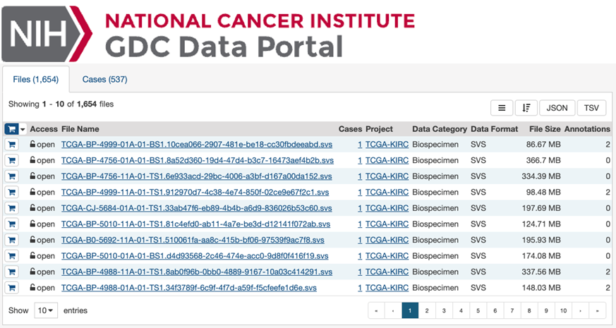 

-   The Cancer Genome Atlas Kidney Renal Clear Cell Carcinoma(TCGA-KIRC), National Cancer Institute GDC Data Portal.
-   癌症基因组图谱肾透明细胞癌（TCGA-KIRC），来自国家癌症研究所GDC数据门户。
-   Including clinical images, genomic, pathological, and clinical data of patients with clear cell renal carcinoma.
-   包括患有透明细胞肾癌患者的临床影像、基因组、病理学和临床数据。
-   200 slice images in SVS formatin the website order.
-   网站上有200张SVS格式的切片图像。

In the selection of our firstdataset, we choose the TCGA-KIRC dataset from the National Cancer Institute GDCData Portal. This research project gathers clinical images, genomic,pathological, and clinical data of patients with clear cell renal carcinoma. Wechoose the original tissue pathology slide images from this dataset andconducted super-resolution training and testing on these image data. 

在选择我们的第一个数据集时，我们选择了来自国家癌症研究所GDC数据门户的TCGA-KIRC数据集。这个研究项目收集了透明细胞肾癌患者的临床影像、基因组、病理和临床数据。我们选择了该数据集中的原始组织病理切片图像，并对这些图像数据进行了超分辨率训练和测试。

**Dataset 1——7108 images(HR\&LR)** 数据集 1 7108 张图像（高分辨率 & 低分辨率）

-   Segmented from 200 SVSimages.&#x20;
-   从200张SVS图像中分割而来。
-   Train Set: 5686, Validation Set: 710, Test Set: 712.
-   训练集：5686，验证集：710，测试集：712。

For this dataset 1, we establishtwo kinds of dataset. We have made a small-scale dataset for the initialtraining and debugging phases of the model, facilitating more efficientevaluation of model performance and parameter optimization. Additionally, itserves as a solution to address the issue of insufficient computer performance. 

对于这个数据集1，我们建立了两种类型的数据集。我们制作了一个小规模数据集用于模型的初始训练和调试阶段，以便更有效地评估模型性能和优化参数。此外，它还解决了计算性能不足的问题。

**Dataset Mini——4020 images(HR\&LR)** 数据集 Mini——4020 张图像（高分辨率 & 低分辨率）

-   To solve the problem of insufficientcomputer performance.
-   为解决计算性能不足的问题。
-   Segmented from a singleSVS image.
-   从单张SVS图像中分割而来。
-   Train Set: 3216, Validation Set: 402, Test Set: 402.
-   训练集：3216，验证集：402，测试集：402。

For the large-scale dataset, thatis what we called Dataset 1, we have 7108 images from 200 SVS images, dividingthem into training set, validation set and test set in a 8:1:1(eight one one) ratio. Boththe HR and LR datasets share these same numbers. And for the small dataset,that is what we called Dataset Mini, we have 4020 images from a single SVSimage, and the ratio of each part is in the same.

对于大规模数据集，即我们所说的数据集1，我们从200张SVS图像中得到了7108张图像，将它们分为训练集、验证集和测试集，比例为8:1:1。高分辨率和低分辨率的数据集均采用这些相同的数字。至于小规模数据集，即我们所说的数据集Mini，我们从一张SVS图像中得到了4020张图像，每个部分的比例相同。

 
  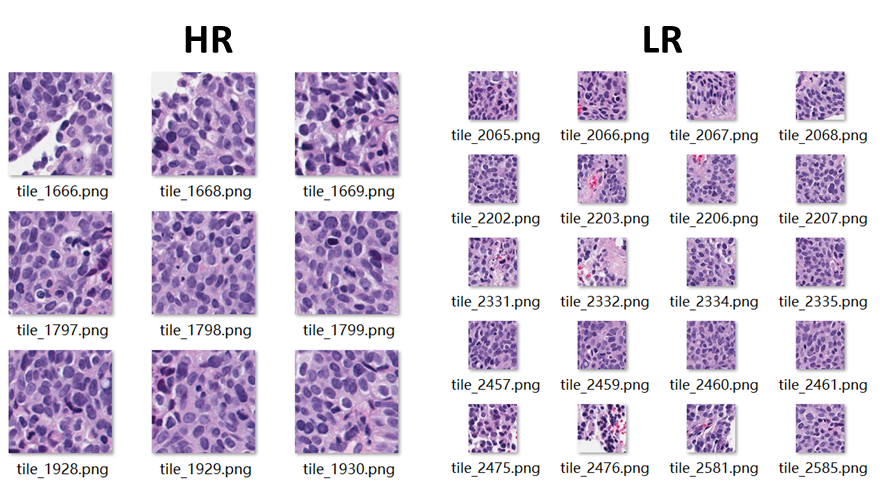 

### Dataset 1 Processing 数据集1处理

#### Processing 处理步骤

 
  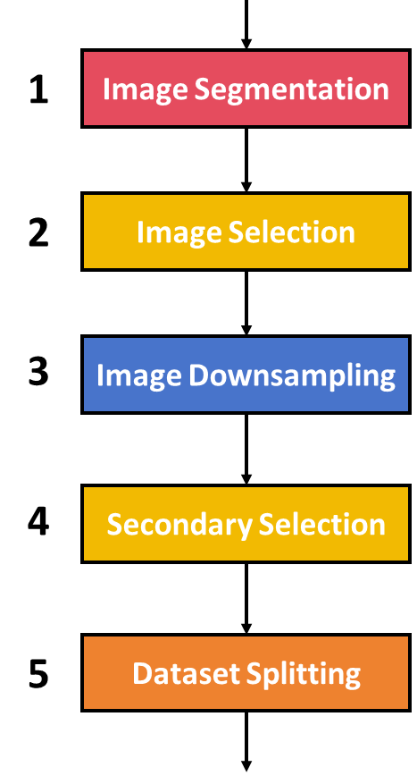   

#### Step 1 Image Segmentation 步骤1 图像分割

Split large SVS files into 256×256 small PNG files.

将大型SVS文件拆分为256×256的小型PNG文件。

 
  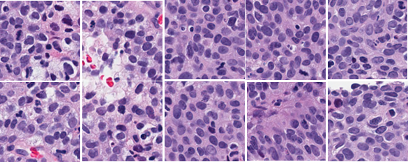   

 

We segmented each SVS image into multiple image blocks with a size of 256x256 pixels, converting them into PNG files, and save them in the HR (high resolution) folder.&#x20;

我们将每个SVS图像分割成多个256x256像素的图像块，将它们转换为PNG文件，并保存在HR（高分辨率）文件夹中。

#### Step 2 Image Selection 步骤2 图像选择

Filter images by grayscale standard deviation (≥30).

通过灰度标准差（≥30）筛选图像。

 
  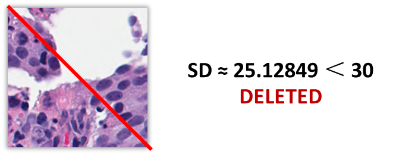   

We assess image quality based on the standard deviation of grayscale values, retaining regions with substantial grayscale variations. We calculate the SD for each pixel, comparing it against a threshold (set at 30). From each original medical pathology image, we select the first 100 images exceeding this threshold, saving them as the HR (high resolution) dataset. 

我们根据灰度值的标准差评估图像质量，保留具有较大灰度变化的区域。我们为每个像素计算标准差，并将其与阈值（设为30）进行比较。从每个原始的医学病理图像中，我们选择第一个超过此阈值的100个图像，将其保存为HR（高分辨率）数据集。

#### Step 3 Image Downsampling 步骤3 图像降采样

Downsample HR images to LR images.(Resolution from 256×256 to 64×64)

将HR图像降采样为LR图像。（分辨率从256×256降到64×64）

 
  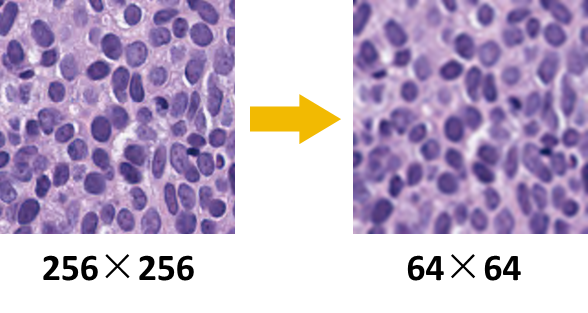   

We downsampled HR images, reducing their resolution to 64×64, and saved the processed images as the LR (low resolution) dataset.

我们将HR图像降采样，将分辨率降低到64×64，并将处理后的图像保存为LR（低分辨率）数据集。

#### Step 4 Secondary Selection 步骤4 二次筛选

Remove images with over 40% of pixels close to all black or all white

删除超过40%的像素接近全黑或全白的图像

 
     

We performed a second round of selection on images in the HR and LR datasets, removing those with over 40% of pixels close to all black or all white.&#x20;

我们对HR和LR数据集中的图像进行了第二轮选择，去除了超过40%的像素接近全黑或全白的图像。

#### Step 5 Dataset Splitting 7108 images(HR\&LR) 步骤5 数据集划分 7108张图像（高分辨率&低分辨率）

Train: 5686, Test: 712 , Val: 710

训练集：5686，测试集：712，验证集：710

We divided the dataset into three sets in a ratio of 8:1:1 as I mentioned before. For the Dataset 1, we have 5686, 710, 712 in turn. These numbers applies to both the HR and LR datasets.

我们按照之前提到的8:1:1比例将数据集划分为三个部分。对于数据集1，我们依次拥有5686，710，712张图像。这些数字适用于HR和LR数据集。

And for **the Dataset Mini**, the five steps are in the same.&#x20; 

对于Mini数据集，这五个步骤是相同的。

### Dataset 2 BreakHis 数据集2 BreakHis

#### Collection 收集来源

The Breast Cancer Histopathological Image Classification is derived from Breast Cancer Histopathological Database (BreakHis).&#x20;

乳腺癌组织病理图像分类源于乳腺癌组织病理数据库（BreakHis）。

 
    

#### Detailed introduction 详细介绍 

The dataset is composed of 9,109 microscopic images of breast tumor tissue collected from 82 patients using different magnifying factors (40X, 100X, 200X, and 400X).&#x20;

该数据集包括从82名患者收集的9,109张显微镜下的乳腺肿瘤组织图像，使用不同的放大倍数（40X, 100X, 200X, 和 400X）。

To date, it contains 2,480 benign and 5,429 malignant samples (700X460 pixels, 3-channel RGB, 8-bit depth in each channel, PNG format).

到目前为止，它包含了2,480个良性和5,429个恶性样本（700X460像素，3通道RGB，每通道8位深度，PNG格式）。

 
  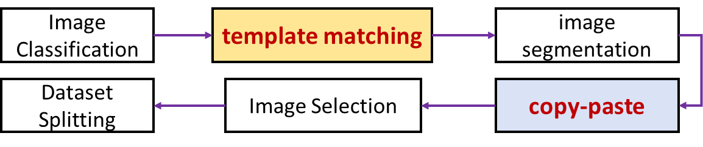  

The dataset is divided into four categories according to magnifications 40x, 100x, 200x, and 400x. Each magnification level contains four types of benign breast tumors and four types of malignant breast tumors based on histopathology.&#x20; 

数据集根据放大倍数40x、100x、200x和400x分为四个类别。每个放大级别包含四种良性乳腺肿瘤和四种恶性乳腺肿瘤的类型，基于组织病理学。

 
  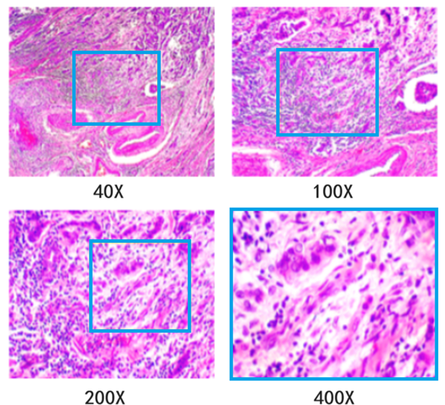    

Within such classification, further divisions are made according to medical records. We conduct six processing steps on this dataset, and the core innovative points are reflected in the use of template matching and copy-paste algorithm. Therefore, I will first introduce the detailed processing procedures of these two steps. 

在这样的分类中，根据医疗记录进一步划分。我们对这个数据集进行了六个处理步骤，核心创新点体现在模板匹配和复制粘贴算法的使用上。因此，我将首先介绍这两个步骤的详细处理程序。

#### Template matching 模板匹配

We replace the standard "downsampling" method for acquiring LR with the use of lower magnification images as our LR dataset. The problem is how to find that area.&#x20;

我们使用较低放大倍数图像作为我们的LR数据集，取代了标准的“降采样”方法来获取LR。问题是如何找到那个区域。

Innovation point one in data processing: Instead of 'downsampling' which is commonly used in image super-resolution enhancement, we use template matching to obtain the LR dataset, using 100x magnification images as our LR dataset for greater realism.&#x20;

数据处理的创新点之一：我们不使用常用的图像超分辨率增强中的‘降采样’，而是使用模板匹配来获得LR数据集，使用100倍放大的图像作为我们的LR数据集，以获得更高的真实感。

**Step 1: Converting to grayscale** 步骤1：转换为灰度图

Convert the image into grayscale to facilitate subsequent calculations.

将图像转换为灰度图，以便于后续计算。

 
  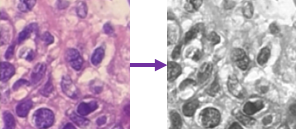     

All color images in the two datasets are converted to grayscale, where the grayscale value of each pixel is between 0-255. 

两个数据集中的所有彩色图像都被转换为灰度图，其中每个像素的灰度值介于0-255之间。

**Step 2: creating filters** 步骤2：创建滤波器

Making a copy of a 400Ximage, reducing the copied part to 175X115 pixels in size, to be used as a filter. 

制作一份400倍图像的副本，将复制的部分缩小到175X115像素大小，用作滤波器。

  
  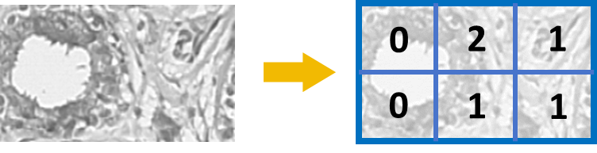   

Then a copy of a 400x image is made, and the copied part is reduced to 175x115 pixels in size as a filter.&#x20;

然后制作一份400倍图像的副本，并将复制的部分缩小到175x115像素大小作为滤镜。

**Step 3: measuring regional similarity** 步骤3：测量区域相似度

Sliding this filter over a 100X image, measuring the matching degree of each region by calculating the differences in grayscale values, setting the matching degree threshold to0.95.

将此滤镜在100倍图像上滑动，通过计算灰度值的差异来测量每个区域的匹配程度，将匹配程度阈值设定为0.95。

 
  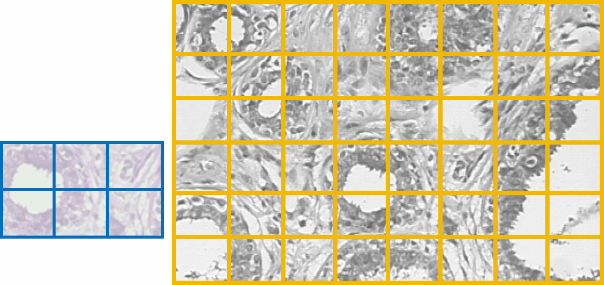  

**Step 4: extracting matched locations** 步骤4：提取匹配位置

finding positions where the matching degree is greater than or equal to this value. Calculate, cut to the matching position.

找到匹配程度大于或等于此值的位置。计算，切割到匹配位置。

 
  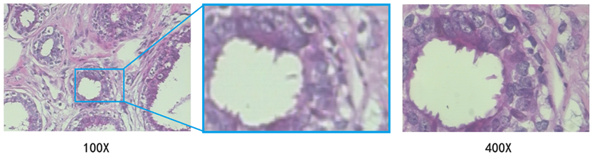   

The positions with a matching degree greater than or equal to this value are then found and extracted. Repeating this process enables batch template matching, and we found the 100x images corresponding to the 400x template. 

然后找到匹配程度大于或等于此值的位置并进行提取。重复这一过程实现批量模板匹配，我们找到了与400倍模板对应的100倍图像。

#### Copy-paste algorithm 复制粘贴算法

We employ the copy-paste algorithm to augment our dataset, as it allows for precisely extracting and repositioning regions of interest within and across images.

我们采用复制粘贴算法来增强我们的数据集，因为它允许在图像内部和图像间精确提取和重新定位感兴趣的区域。

Innovation point two in data processing: The dataset is augmented using the copy-paste algorithm. Specifically, three source regions are randomly selected for copying, and three random target locations are selected for pasting to generate a new image. The above shows the effect comparison before and after using the copy-paste algorithm. 

数据处理的创新点二：使用复制粘贴算法增强数据集。具体来说，随机选择三个源区域进行复制，随机选择三个目标位置进行粘贴，以生成新图像。上述展示了使用复制粘贴算法前后的效果对比。

 
  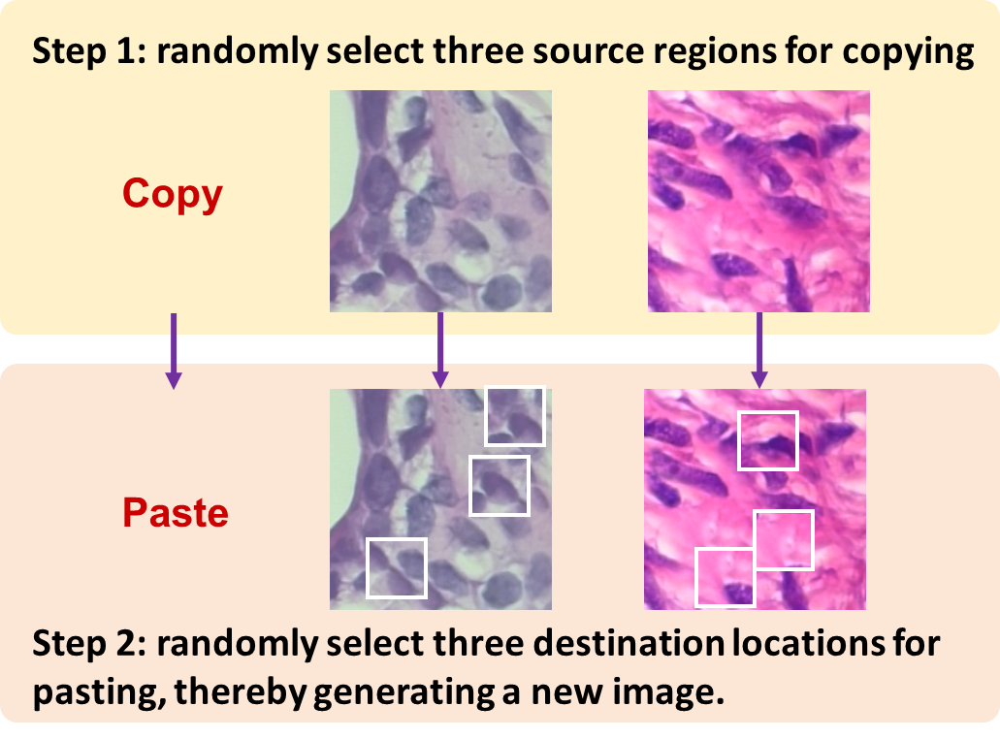  

Insummary, the processing procedures for this dataset include six steps:&#x20;

总结来说，该数据集的处理程序包括六个步骤：

1\) Image classification. 2) Template matching. 3) Image segmentation. 4) Copy-paste algorithm. 5) Variance thresholding to remove abnormal images. 6) Dividing into train, test and validation sets with a ratio of 8:1:1. The dataset size and pixel changes at each step are also presented next to the steps.

1)图像分类。2) 模板匹配。3) 图像分割。4) 复制粘贴算法。5) 方差阈值处理以移除异常图像。6) 按照8:1:1的比例划分训练集、测试集和验证集。每个步骤的数据集大小和像素变化也在步骤旁边呈现。

 
  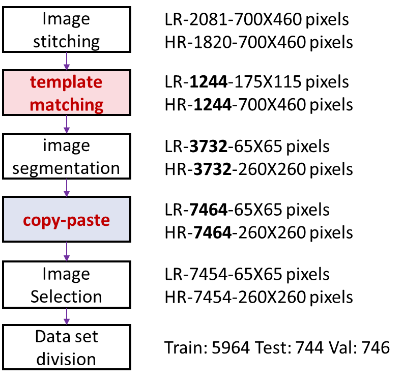   

## SRTN Model SRTN模型

### ScResTransNet

  
  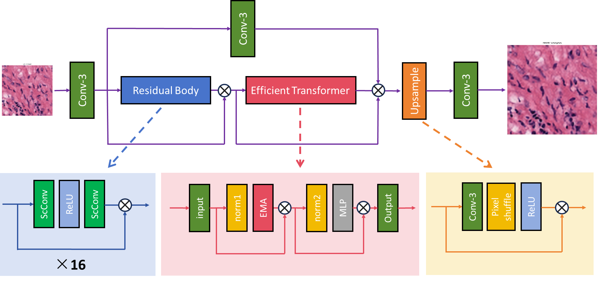   

OurSRTN model, building upon the foundation of EDSR, introduces enhancedefficiency in structure. In the Residual Body, numerous residual connectionsare employed, featuring a novel substitution of ScConvlayers for traditional convolutional layers. This innovation not only retainsthe core of convolutional benefits but alsoinfuses additional adaptability into the model. 

我们的SRTN模型，在EDSR的基础上构建，引入了结构上的高效率。在残差体中，使用了众多残差连接，并采用了新颖的ScConv层替代传统的卷积层。这种创新不仅保留了卷积的核心优势，还为模型增添了额外的适应性。

The Efficient Transformer module is a cornerstone of our design, utilizing an Efficient Multi-Head Attention mechanism, known as EMA, alongside a Multilayer Perceptron (MLP) network. For the up sampling process, we have integrated sub-pixel convolution layers, ensuring a meticulous upscaling of image resolution while preserving intricate details. This architecture culminates in a refined balance of performance and efficiency.

高效变换器模块是我们设计的基石，采用了高效多头注意力机制，称为EMA，以及多层感知机（MLP）网络。在上采样过程中，我们整合了子像素卷积层，确保在保留细节的同时精细地提升图像分辨率。这种架构最终实现了性能与效率的精细平衡。

### Residual Body 残差体

The Residual Body, based on the design from Residual Network, makes the training process more efficient.

残差体基于残差网络的设计，使训练过程更为高效。

We spotlight the Residual Body of our model, which is inspired by the Residual Network design and consists of 16residual blocks. Each block incorporates the innovative ScConv layers that replace traditional convolution layers. The adoption of ScConv, standing for Spatial and Channel-wise Reconstruction Convolution, significantly reduces feature redundancy.

我们的模型中的残差体灵感来源于残差网络设计，包括16个残差块。每个块都采用了创新的ScConv层来替代传统的卷积层。ScConv的采用，代表空间和通道重建卷积，显著减少了特征的冗余。

 
  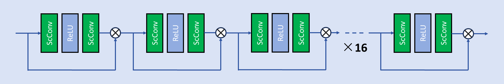   

The SCConv module, reducing redundant features in convolution layers, enhances model performance and efficiency while lowering computational costs and complexity. 

SCConv模块通过减少卷积层中的冗余特征，提高了模型的性能和效率，同时降低了计算成本和复杂性。

 
  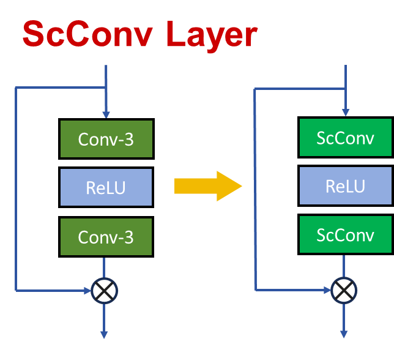    

This design is important in enhancing the model's performance by streamlining features more effectively, thus leading to a substantial reduction in computational costs and complexity. Our approach presents a leap forward in model efficiency, balancing high performance with lower computational demands. 

这种设计通过更有效地简化特征，重要地提升了模型的性能，从而大幅度减少了计算成本和复杂性。我们的方法在模型效率方面取得了飞跃，实现了高性能与较低计算需求的平衡。

 
  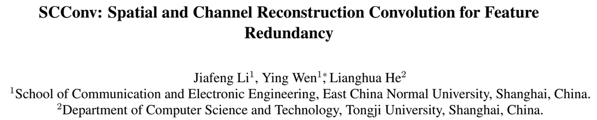  

The Efficient Transformer (ET) is at the heart of our model's architecture for medical image super-resolution enhancement. It begins with an embedding convolution to transform the input tensor for subsequent layers. Layer normalization is applied to stabilize the activations before attention, followed by the Efficient Multi-head Attention(EMA) module that computes attention with reduced complexity, enhancing processing efficiency. Post-attention normalization ensures stable output from the attention mechanism. A feedforward neural network applies non-linear transformations, and a feature mapping convolution generates the final output tensor. 

高效Transformer（ET）是我们的模型架构中的核心，用于医学图像超分辨率增强。它从嵌入卷积开始，将输入张量转换为后续层的处理。在注意力机制之前应用层归一化以稳定激活，接着是计算复杂度较低的高效多头注意力（EMA）模块，提高处理效率。注意力后的归一化确保了来自注意力机制的稳定输出。前馈神经网络应用非线性变换，特征映射卷积生成最终的输出张量。

 
  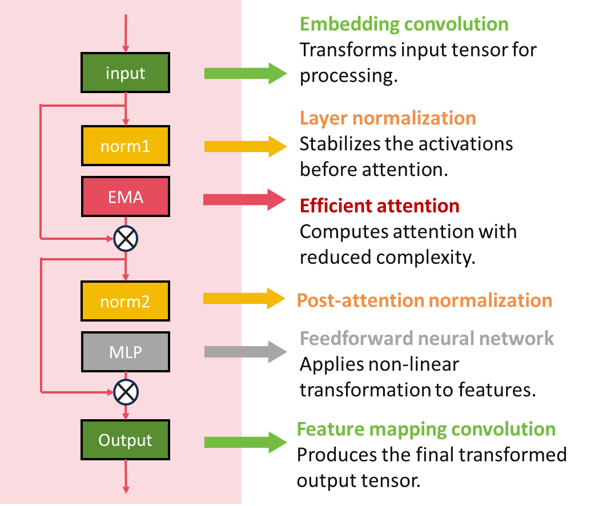   

 
  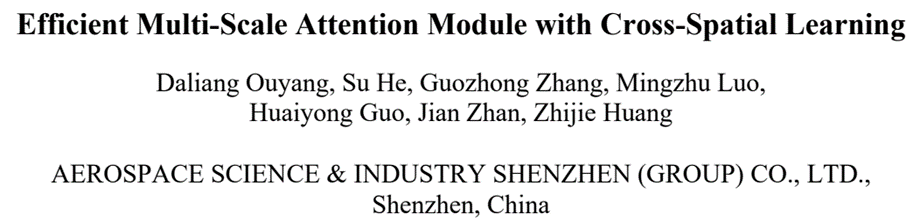  

We use the sub-pixel convolution layer to upscale the image resolution. This layer rearranges low-resolution inputs into high-resolution outputs, increasing pixel density and ensuring the clarity of enhanced medical images. 

我们使用子像素卷积层来提升图像分辨率。这层重新排列低分辨率输入为高分辨率输出，增加像素密度，并确保增强医学图像的清晰度。

 
  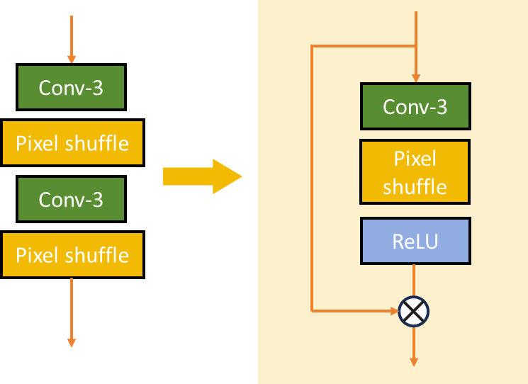   

It rearranges the low-resolution input into high-resolution output to increase the pixel density of the image.

它将低分辨率输入重新排列成高分辨率输出，以增加图像的像素密度。

### Implementation of the Model 模型实现

#### Mainframe of the SRTN Model SRTN模型主框架

 
  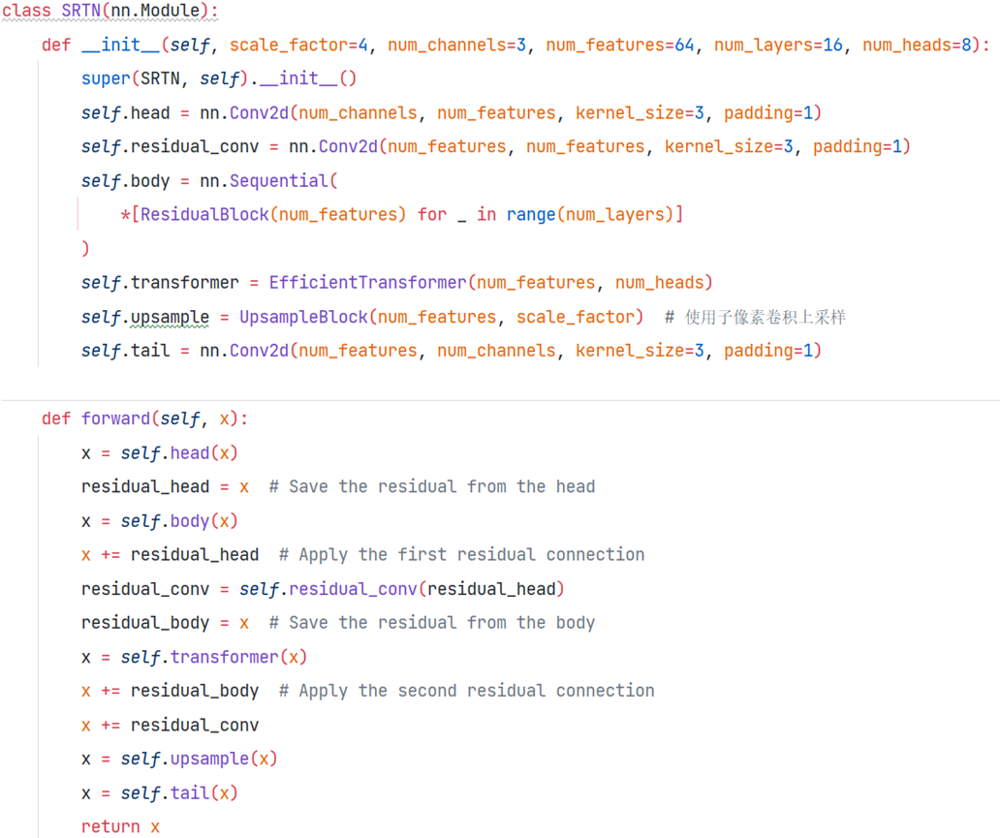   

This code defines a model named SRTN ,as shown in the image. It consists of head, residual convolution, body, transformer, 'upsamle' and tail. The left image shows the changes in the tensor after passing through different modules, allowing us to observe the evolution and transformation of features. 

这段代码定义了一个名为SRTN的模型，如图所示。它由头部、残差卷积、主体、变换器、'上采样'和尾部组成。左侧图像显示了张量通过不同模块后的变化，使我们能够观察到特征的演变和转换。

 
       

#### **The two main modules** 两个主要模块

Efficient Transformer and Simple ResidualBlock . Efficient Transformer module is used for feature transformation and extraction, offering efficient performance. It comprises three main parts: input embeddings convolution, transformer block, and output embeddings convolution. This module effectively handles features to enhance the model's performance and representation capabilities.

高效Transformer和简单残差块。高效变换器模块用于特征转换和提取，提供高效的性能。它包括三个主要部分：输入嵌入卷积、变换器块和输出嵌入卷积。该模块有效地处理特征，以增强模型的性能和表征能力。

 
  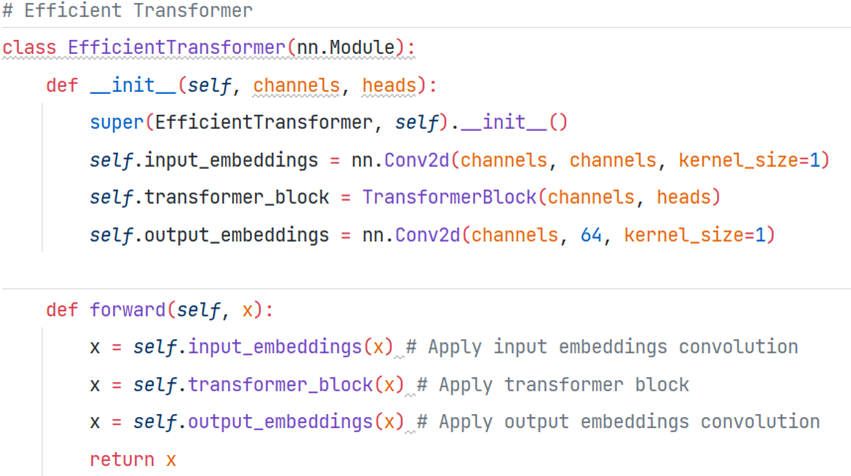   

Simple ResBlock module is used to implement residual connections in the model. It consists of two convolutional layers and a ReLU activation function. In our implementation, we have replaced the convolutional layers in ResBlock with the previously mentioned SCconv. By using it, we reduce the extraction of redundant features in the convolutional layers, thereby reducing computational and storage costs.&#x20;

简单ResBlock模块用于在模型中实现残差连接。它由两个卷积层和一个ReLU激活函数组成。在我们的实现中，我们用之前提到的SCconv替换了ResBlock中的卷积层。通过使用它，我们减少了卷积层中冗余特征的提取，从而降低了计算和存储成本。

 
  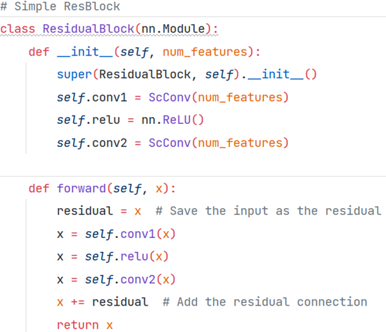   

#### Training and Validation 训练和验证

We defined the mean square error (MSE) loss function. We also used the Adamoptimizer with a learning rate of 0.001

我们定义了均方误差（MSE）损失函数。我们还使用了学习率为0.001的Adam优化器。

 
  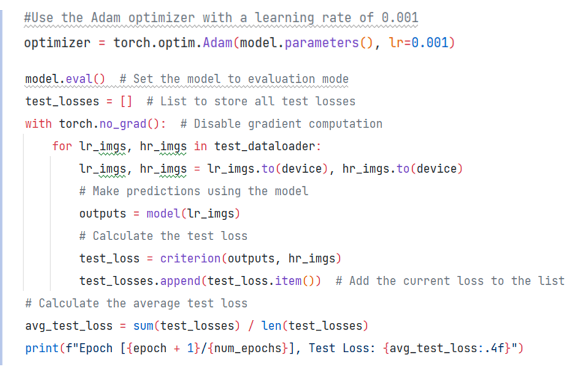  

We evaluate the model on test data. We make predictions, calculate test loss, and store results. By comparing predicted outputs with ground truth, we assess model performance. 

我们在测试数据上评估模型。我们进行预测，计算测试损失，并存储结果。通过比较预测输出和真实值，我们评估模型性能。

 
  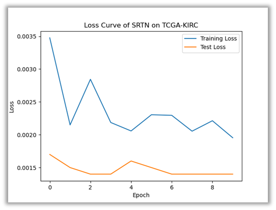   

### Model Comparison 模型比较

**Training error curves of different models:** 不同模型的训练误差曲线：

 
  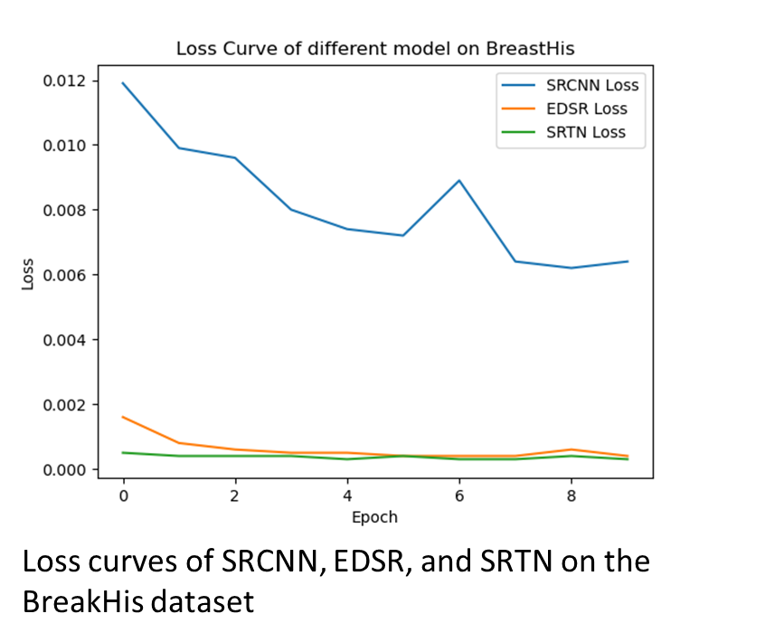   

The SRTN model has the lowest loss, and its loss curve is relatively smooth, indicating a stable training process and stronger generalization ability.  

SRTN模型具有最低的损失，其损失曲线相对平滑，表明训练过程稳定，泛化能力更强。

**Performance of SRTN on different datasets:** SRTN在不同数据集上的表现：

 
  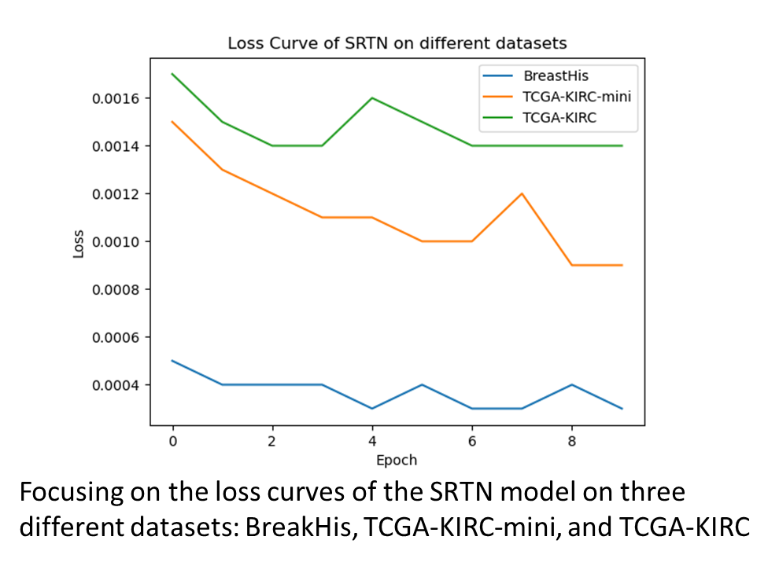   

On the complex BreakHis dataset, SRTN has the lowest loss, demonstrating the model's excellent adaptability and performance on this specific dataset. 

在复杂的BreakHis数据集上，SRTN具有最低的损失，展示了该模型在这一特定数据集上的出色适应性和性能。

#### PSNR ( Peak signal-to-noise ratio ) PSNR（峰值信噪比）

-K(i,j)]^2)

  
  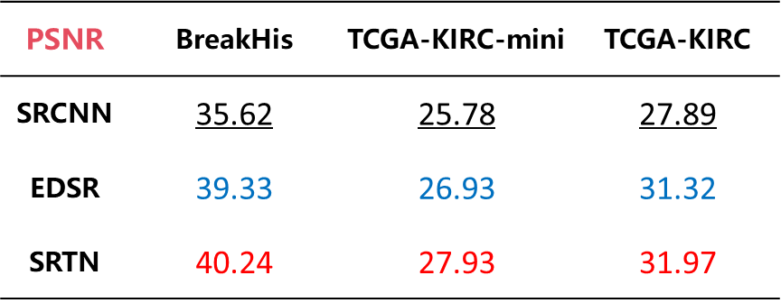     

#### SSIM ( Structure Similarity Index Measure ) SSIM（结构相似性指数测量）

 
  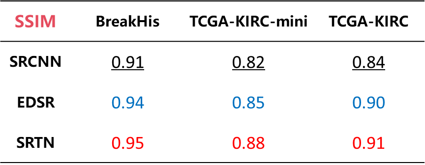    

 

Our integrated approach significantly improves the precision and usability of medical imaging, which is pivotal for accurate diagnosis and treatment planning.

我们的综合方法显著提高了医学成像的精确性和可用性，这对于准确的诊断和治疗计划至关重要。
