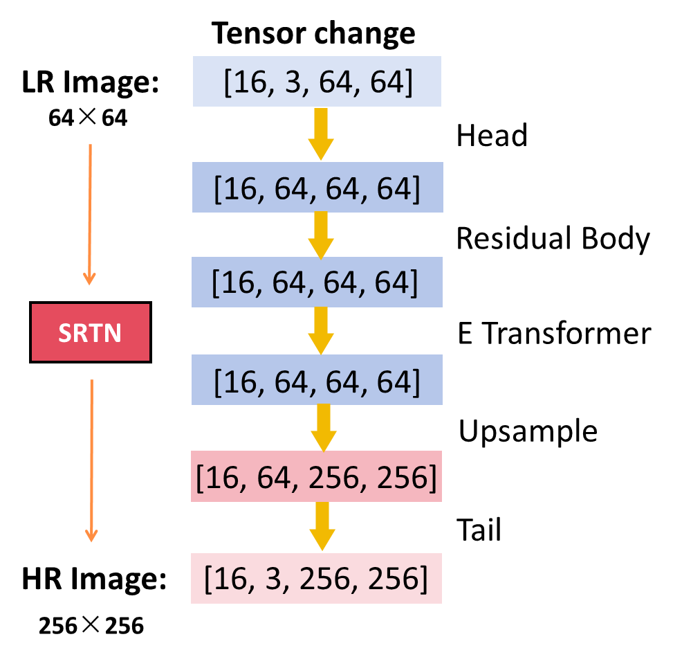

# G4-SRTN Development Documentation

## Team Information

**Team: Deep Thinkers-G4**

**Team Members and Contributions (in the order of final pre)**

-   **LIU Qifan (**[**fanfan\_lqf@163.com**](mailto:fanfan_lqf@163.com "fanfan_lqf@163.com")): 
    -   Kept track of project progress, read literature, and wrote the introduction and background sections of the paper.&#x20;
-   **YING Yiyuan (**[**yiyuanying@outlook.com**](mailto:yiyuanying@outlook.com "yiyuanying@outlook.com")): 
    -   Downloaded and organized Dataset 1 (TCGA-KIRC), wrote the data processing section of the paper.
-   **FAN Hongyue (**[**21011171@mail.ecust.edu.cn**](mailto:21011171@mail.ecust.edu.cn "21011171@mail.ecust.edu.cn")): 
    -   Processed Dataset 2 (BreastHis), proposed innovative methods for data handling.&#x20;
-   **CHEN Yishen (**[**ohhcys@gmail.com**](mailto:ohhcys@gmail.com "ohhcys@gmail.com")): 
    -   Team leader, responsible for guiding the direction of the project, proposed innovative methods for the model, and implemented the model's code.
-   **ZHANG Zehong (**[**21013074@mail.ecust.edu.cn**](mailto:21013074@mail.ecust.edu.cn "21013074@mail.ecust.edu.cn")): 
    -   Trained the model, fine-tuned parameters, and participated in the innovation process of the model.
-   **CHEN Ying (**[**21013172@mail.ecust.edu.cn**](mailto:21013172@mail.ecust.edu.cn "21013172@mail.ecust.edu.cn")): 
    -   Organized the output information of the model, wrote the model comparison and results sections of the paper, and created the PowerPoint presentation.

## Code File Tree

-   **Data1\_process**
    -   Step 1 SVS extracts png image blocks.py
    -   Step 2 Select suitable images.py
    -   Step 3 downsampling\_ X4 and x8 magnification.py
    -   Step 4 Delete abnormal images from each folder.py
    -   Step 5 Divide three datasets.py
-   **Data2\_process**
    -   0.Merge images of the same size.py
    -   1.Template matching 100X-400X.py
    -   2.Batch template matching 100X-400X.py
    -   3.Batch actuators.py
    -   4.Left center right segmentation.py
    -   5.Copy and Paste Enhancement.py
    -   6.Delete abnormal images.py
    -   7.Downsampling\_ X4 magnification.py
    -   8.Divide into three datasets.py
-   **Model Evaluation**
    -   Calculate the average MSE of interpolated images and HR.py
    -   Loss Curve of different models on BreakHis.py
    -   Loss Curve of SRTN on different datasets.py
    -   Model validation.py
-   **Models(other's)**
    -   EDSR.py
    -   SRCNN.py
    -   train\_EDSR.py
-   **SRTN(our model)**
    -   ScConv.py
    -   SRTN.py
    -   train\_SRTN.py
-   **Train\_result\_pth**

## Contents 

-   [Team Information](#Team-Information)
-   [Code File Tree](#Code-File-Tree)
-   [Data Acquisition and Processing](#Data-Acquisition-and-Processing)
    -   [Dataset 1: TCGA-KIRC
        ](#Dataset-1-TCGA-KIRC)
        -   [Collection](#Collection)
    -   [Dataset 1 Processing](#Dataset-1-Processing)
        -   [Processing](#Processing)
        -   [Step 1: Image Segmentation](#Step-1-Image-Segmentation)
        -   [Step 2: Image Selection](#Step-2-Image-Selection) 
        -   [Step 3: Image Downsampling
            ](#Step-3-Image-Downsampling)
        -   [Step 5: Dataset Splitting——7108 images(HR\&LR)](#Step-5-Dataset-Splitting7108-imagesHRLR) 
    -   [Dataset 2: BreakHis ](#Dataset-2-BreakHis-)
        -   [Collection](#Collection)
        -   [Detailed introduction](#Detailed-introduction) 
        -   [Template matching](#Template-matching)
        -   [Copy-paste algorithm](#Copy-paste-algorithm)
-   [SRTN Model](#SRTN-Model)
    -   [ScResTransNet](#ScResTransNet)
    -   [Residual Body
        ](#Residual-Body)
-   [Implementation of the Model
    ](#Implementation-of-the-Model)
    -   [Mainframe of the SRTN Model](#Mainframe-of-the-SRTN-Model)
    -   [The two main modules](#The-two-main-modules)
    -   [Training and Validation](#Training-and-Validation)
-   [Model Comparison
    ](#Model-Comparison)
    -   [PSNR ( Peak signal-to-noise ratio )](#PSNR--Peak-signal-to-noise-ratio-)
    -   [SSIM ( Structure Similarity Index Measure ) ](#SSIM--Structure-Similarity-Index-Measure--)

## Data Acquisition and Processing 数据采集和处理

### Dataset 1: TCGA-KIRC&#xD; 数据集 1: TCGA-KIRC

#### Collection 收集来源:

   

-   The Cancer Genome Atlas Kidney Renal Clear Cell Carcinoma(TCGA-KIRC), National Cancer Institute GDC Data Portal.
-   癌症基因组图谱肾透明细胞癌（TCGA-KIRC），来自国家癌症研究所GDC数据门户。
-   Including clinical images, genomic, pathological, and clinical data of patients with clear cell renal carcinoma.
-   包括患有透明细胞肾癌患者的临床影像、基因组、病理学和临床数据。
-   200 slice images in SVS formatin the website order.
-   网站上有200张SVS格式的切片图像。

In the selection of our firstdataset, we choose the TCGA-KIRC dataset from the National Cancer Institute GDCData Portal. This research project gathers clinical images, genomic,pathological, and clinical data of patients with clear cell renal carcinoma. Wechoose the original tissue pathology slide images from this dataset andconducted super-resolution training and testing on these image data. 

在选择我们的第一个数据集时，我们选择了来自国家癌症研究所GDC数据门户的TCGA-KIRC数据集。这个研究项目收集了透明细胞肾癌患者的临床影像、基因组、病理和临床数据。我们选择了该数据集中的原始组织病理切片图像，并对这些图像数据进行了超分辨率训练和测试。

**Dataset 1——7108 images(HR\&LR)** 数据集 1——7108 张图像（高分辨率 & 低分辨率）

-   Segmented from 200 SVSimages.&#x20;
-   从200张SVS图像中分割而来。
-   Train Set: 5686, Validation Set: 710, Test Set: 712.
-   训练集：5686，验证集：710，测试集：712。

For this dataset 1, we establishtwo kinds of dataset. We have made a small-scale dataset for the initialtraining and debugging phases of the model, facilitating more efficientevaluation of model performance and parameter optimization. Additionally, itserves as a solution to address the issue of insufficient computer performance. 

对于这个数据集1，我们建立了两种类型的数据集。我们制作了一个小规模数据集用于模型的初始训练和调试阶段，以便更有效地评估模型性能和优化参数。此外，它还解决了计算性能不足的问题。

**Dataset Mini——4020 images(HR\&LR)** 数据集 Mini——4020 张图像（高分辨率 & 低分辨率）

-   To solve the problem of insufficientcomputer performance.
-   为解决计算性能不足的问题。
-   Segmented from a singleSVS image.
-   从单张SVS图像中分割而来。
-   Train Set: 3216, Validation Set: 402, Test Set: 402.
-   训练集：3216，验证集：402，测试集：402。

For the large-scale dataset, thatis what we called Dataset 1, we have 7108 images from 200 SVS images, dividingthem into training set, validation set and test set in a 8:1:1(eight one one) ratio. Boththe HR and LR datasets share these same numbers. And for the small dataset,that is what we called Dataset Mini, we have 4020 images from a single SVSimage, and the ratio of each part is in the same.

对于大规模数据集，即我们所说的数据集1，我们从200张SVS图像中得到了7108张图像，将它们分为训练集、验证集和测试集，比例为8:1:1。高分辨率和低分辨率的数据集均采用这些相同的数字。至于小规模数据集，即我们所说的数据集Mini，我们从一张SVS图像中得到了4020张图像，每个部分的比例相同。

 
   

### Dataset 1 Processing

#### Processing

 
     

#### Step 1: Image Segmentation

Split large SVS files into 256×256 small PNG files.

 
     

 

We segmented each SVS image into multiple image blocks with a size of 256x256 pixels, converting them into PNG files, and save them in the HR (high resolution) folder.&#x20;

#### Step 2: Image Selection

Filter images by grayscale standard deviation (≥30).

 
     

We assess image quality based on the standard deviation of grayscale values, retaining regions with substantial grayscale variations. We calculate the SD for each pixel, comparing it against a threshold (set at 30). From each original medical pathology image, we select the first 100 images exceeding this threshold, saving them as the HR (high resolution) dataset. 

#### Step 3: Image Downsampling&#xD;

Downsample HR images to LR images.(Resolution from 256×256 to 64×64)

 
     

We downsampled HR images, reducing their resolution to 64×64, and saved the processed images as the LR (low resolution) dataset.

**Step 4: Secondary Selection**

Remove images with over 40% of pixels close to all black or all white

 
     

We performed a second round of selection on images in the HR and LR datasets, removing those with over 40% of pixels close to all black or all white.&#x20;

#### Step 5: Dataset Splitting——7108 images(HR\&LR)

Train: 5686, Test: 712 , Val: 710

We divided the dataset into three sets in a ratio of 8:1:1 as I mentioned before. For the Dataset 1, we have 5686, 710, 712 in turn. These numbers applies to both the HR and LR datasets.

And for **the Dataset Mini**, the five steps are in the same.&#x20; 

### Dataset 2: BreakHis&#x20;

#### Collection

The Breast Cancer Histopathological Image Classification is derived from Breast Cancer Histopathological Database (BreakHis).&#x20;

 
    

#### Detailed introduction

The dataset is composed of 9,109 microscopic images of breast tumor tissue collected from 82 patients using different magnifying factors (40X, 100X, 200X, and 400X).&#x20;

To date, it contains 2,480 benign and 5,429 malignant samples (700X460 pixels, 3-channel RGB, 8-bit depth in each channel, PNG format).

 
    

The dataset is divided into four categories according to magnifications 40x, 100x, 200x, and 400x. Each magnification level contains four types of benign breast tumors and four types of malignant breast tumors based on histopathology.&#x20; 

 
      

Within such classification, further divisions are made according to medical records. We conduct six processing steps on this dataset, and the core innovative points are reflected in the use of template matching and copy-paste algorithm. Therefore, I will first introduce the detailed processing procedures of these two steps. 

#### Template matching

We replace the standard "downsampling" method for acquiring LR with the use of lower magnification images as our LR dataset. The problem is how to find that area.&#x20;

Innovation point one in data processing: Instead of 'downsampling' which is commonly used in image super-resolution enhancement, we use template matching to obtain the LR dataset, using 100x magnification images as our LR dataset for greater realism.&#x20;

**Step 1: Converting to grayscale**

Convert the image into grayscale to facilitate subsequent calculations. 

 
       

All color images in the two datasets are converted to grayscale, where the grayscale value of each pixel is between 0-255. 

**Step 2: creating filters**

Making a copy of a 400Ximage, reducing the copied part to 175X115 pixels in size, to be used as a filter. 

  
     

Then a copy of a 400x image is made, and the copied part is reduced to 175x115 pixels in size as a filter.&#x20;

**Step 3: measuring regional similarity**

Sliding this filter over a 100X image, measuring the matching degree of each region by calculating the differences in grayscale values, setting the matching degree threshold to0.95.
 

 
    

This filter slid over the 100x image to measure the matching degree of each region against the filter by calculating the differences in grayscale values, with the matching degree threshold set to 0.95.&#x20;

**Step 4: extracting matched locations**

finding positions where the matching degree is greater than or equal to this value. Calculate, cut to the matching position.

 
     

The positions with a matching degree greater than or equal to this value are then found and extracted. Repeating this process enables batch template matching, and we found the 100x images corresponding to the 400x template. 

#### Copy-paste algorithm

We employ the copy-paste algorithm to augment our dataset, as it allows for precisely extracting and repositioning regions of interest within and across images.

Innovation point two in data processing: The dataset is augmented using the copy-paste algorithm. Specifically, three source regions are randomly selected for copying, and three random target locations are selected for pasting to generate a new image. The above shows the effect comparison before and after using the copy-paste algorithm. 

 
    

Insummary, the processing procedures for this dataset include six steps:&#x20;

1\) Image classification. 2) Template matching. 3) Image segmentation. 4) Copy-paste algorithm. 5) Variance thresholding to remove abnormal images. 6) Dividing into train, test and validation sets with a ratio of 8:1:1. The dataset size and pixel changes at each step are also presented next to the steps.

 
     

## SRTN Model

### ScResTransNet

  
     

OurSRTN model, building upon the foundation of EDSR, introduces enhancedefficiency in structure. In the Residual Body, numerous residual connectionsare employed, featuring a novel substitution of ScConvlayers for traditional convolutional layers. This innovation not only retainsthe core of convolutional benefits but alsoinfuses additional adaptability into the model. 

The Efficient Transformer module is a cornerstone of our design, utilizing an Efficient Multi-Head Attention mechanism, known as EMA, alongside a Multilayer Perceptron (MLP) network. For the up sampling process, we have integrated sub-pixel convolution layers, ensuring a meticulous upscaling of image resolution while preserving intricate details. This architecture culminates in a refined balance of performance and efficiency.

### Residual Body&#xD;

The Residual Body, based on the design from Residual Network, makes the training process more efficient.

We spotlight the Residual Body of our model, which is inspired by the Residual Network design and consists of 16residual blocks. Each block incorporates the innovative ScConv layers that replace traditional convolution layers. The adoption of ScConv, standing for Spatial and Channel-wise Reconstruction Convolution, significantly reduces feature redundancy.

 
     

The SCConv module, reducing redundant features in convolution layers, enhances model performance and efficiency while lowering computational costs and complexity. 

 
      

This design is important in enhancing the model's performance by streamlining features more effectively, thus leading to a substantial reduction in computational costs and complexity. Our approach presents a leap forward in model efficiency, balancing high performance with lower computational demands. 

 
    

Our Efficient Transformer (ET) is at the heart of our model's architecture for medical image super-resolution enhancement. It begins with an embedding convolution to transform the input tensor for subsequent layers. Layer normalization is applied to stabilize the activations before attention, followed by the Efficient Multi-head Attention(EMA) module that computes attention with reduced complexity, enhancing processing efficiency. Post-attention normalization ensures stable output from the attention mechanism. A feedforward neural network applies non-linear transformations, and a feature mapping convolution generates the final output tensor. 

 
     

 
    

We use the sub-pixel convolution layer to upscale the image resolution. This layer rearranges low-resolution inputs into high-resolution outputs, increasing pixel density and ensuring the clarity of enhanced medical images. 

 
     

It rearranges the low-resolution input into high-resolution output to increase the pixel density of the image.

Implementation of the Model

#### Mainframe of the SRTN Model

 
     

This code defines a model named SRTN ,as shown in the image. It consists of head, residual convolution, body, transformer, 'upsamle' and tail. The left image shows the changes in the tensor after passing through different modules, allowing us to observe the evolution and transformation of features. 

 
       

#### **The two main modules**

Efficient Transformer and Simple ResidualBlock . Efficient Transformer module is used for feature transformation and extraction, offering efficient performance. It comprises three main parts: input embeddings convolution, transformer block, and output embeddings convolution. This module effectively handles features to enhance the model's performance and representation capabilities.

 
     

Simple ResBlock module is used to implement residual connections in the model. It consists of two convolutional layers and a ReLU activation function. In our implementation, we have replaced the convolutional layers in ResBlock with the previously mentioned SCconv. By using it, we reduce the extraction of redundant features in the convolutional layers, thereby reducing computational and storage costs.&#x20;

 
     

#### Training and Validation

We defined the mean square error (MSE) loss function. We also used the Adamoptimizer with a learning rate of 0.001

 
    

We evaluate the model on test data. We make predictions, calculate test loss, and store results. By comparing predicted outputs with ground truth, we assess model performance.  

 
     

Model Comparison

**Training error curves of different models:**

 
     

The SRTN model has the lowest loss, and its loss curve is relatively smooth, indicating a stable training process and stronger generalization ability.  

**Performance of SRTN on different datasets:** 

 
     

On the complex BreakHis dataset, SRTN has the lowest loss, demonstrating the model's excellent adaptability and performance on this specific dataset. 

#### **PSNR ( Peak signal-to-noise ratio )**

-K(i,j)]^2)

  
       

#### \*\*SSIM ( Structure Similarity Index Measure ) \*\*

 
      

 

Our integrated approach significantly improves the precision and usability of medical imaging, which is pivotal for accurate diagnosis and treatment planning.
